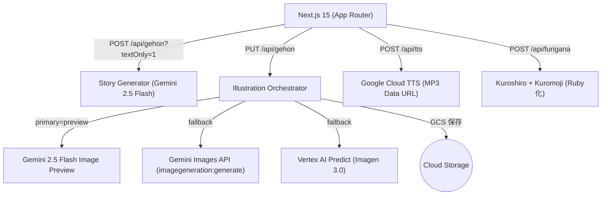

> 子どもの名前と好きなものを入れるだけ。AI が昔話やオリジナルの物語から、本文と水彩イラストを自動生成して絵本を作ります。本記事は Gehon の制作工程、仕組み、主要コード、設計判断、そして今後の展望をまとめたコンテスト提出用ドキュメントです。

- デモ: 現在は API コストの都合で公開停止中です  
- リポジトリ: https://github.com/yuk1-kondo/Gehon

## 目次
- イントロ / 目標
- 全体アーキテクチャ
- ユースケースとUX設計
- 実装の要点（API/フロント/プロンプト設計）
- ふりがな（読みがな）機能
- デプロイと運用（Cloud Run / Cloud Build）
- デバッグと検証方法
- 学びと設計判断
- 今後の拡張計画（ロードマップ）

---

## イントロ / 目標
- 目的: 子ども向けの短い絵本（全10ページ）を、できるだけ一貫した絵柄で素早く生成する。
- 背景: 手が離せない大人が YouTube やゲームを渡す状況を、能動的な創作体験に置き換えたい。
- 特徴:
  - 子ども自身が主人公として登場（敬称も選択可）。
  - Firebase なし。Next.js + 複数の Gemini 系APIをオーケストレーション。
  - 本文と各ページのイラストを自動生成。ページ単位で前ページ画像を参照し“絵柄一貫性”を強化。
  - まず本文だけ生成して即表示→画像はページを開いたタイミングで段階生成。
  - 画像は GCS に保存し公開URLで返却（閲覧安定・PDF保存しやすい）。
  - ふりがな表示・読み上げ（TTS）・PDF出力に対応。

---

## 全体アーキテクチャ



- フロント: App Router（`app/`）でフォーム→本文生成→ページごとに画像生成・再生成。
- API:
  - `POST /api/gehon?textOnly=1` … 本文のみ（JSON）
  - `PUT /api/gehon` … 指定ページの画像生成（前ページを参照）
  - `POST /api/tts` … テキストの音声合成（MP3 Data URL）
  - `POST /api/furigana` … テキストを `<ruby>` HTML に変換（Kuroshiro）
- ストレージ: 生成画像は可能なら GCS に保存し公開URLを返却。PDF保存との相性を最適化。

---

## ユースケースとUX設計
- 入力: 子どもの名前・敬称・題材（昔話 or オリジナル）
- フロー:
  1) 物語（本文）をすぐに生成して読み始められる
  2) ページを進めるたびに、そのページの画像を自動生成（前ページ画像を参照入力して一貫性UP）
  3) 画像は3候補から自動選択（aHash + ハミング距離で前ページと近いもの）
  4) 「このページの画像を再生成」で差し替え可能
  5) 10ページ揃ったらサマリーで「ふりがな表示」「読み上げ」「PDF保存」
- プロンプト表示トグル（デフォルト非表示）で透明性も確保。

---

## 実装の要点（API/フロント/プロンプト設計）

### 本文生成（Gemini 2.5 Flash）
- System Instruction で「厳格な JSON のみ」を強制。`pages` に `idx / right_text_ja / left_image_desc` を必須化。
- サニタイズ: 現代ガジェット/商標/英数字などのノイズを除去、やさしい日本語に整形。

ファイル: `app/api/gehon/route.ts`（抜粋）
```ts
const generateStory = async (prompt: string) => {
  const systemInstruction = { /* JSONのみ返すよう強制 */ };
  const body = {
    systemInstruction,
    contents: [{ role: 'user', parts: [{ text: prompt }] }],
    generationConfig: { responseMimeType: 'application/json' }
  };
  const data = await fetchJson(`${GEMINI_ENDPOINT(STORY_MODEL)}?key=${apiKey}`, { /* ... */ });
  // parts[].text を連結して JSON 文字列化
};

// 緊強な JSON 抽出（コードブロック除去・余白除去・失敗許容）
const tryParseJson = (raw: string): { pages: AIPage[] } | null => { /* ... */ };
```

### イラスト生成のプロンプト設計
- ベース: 「日本の昔話・水彩絵本スタイル」。構図・和色・背景・質感を肯定指示で固定。
- 禁止: カメラ/レンズ/現代ガジェット/ロゴ/署名/英数字/フォトリアル等。

ファイル: `app/api/gehon/route.ts`（抜粋）
```ts
const buildIllustrationPrompt = (storyTitle, pageDesc, childNameDisplay, storySnippet?) => `
スタイル: 日本の昔話・水彩絵本スタイル ...
和色パレット: 生成り(#F3EAD3), 藍色(#274A78), 茜色(#B7282E) ...
主人公: ${childNameDisplay} を毎ページ同一人物として描く（役割があるカット）
ページの内容指示: ${pageDesc}
物語本文の要点: ${storySnippet ?? '（このページ本文の要点を反映）'}
重要: 写真ではなく手描き水彩。カメラ/レンズ表現は禁止
避ける: ロゴ/署名/英数字/現代ガジェット/実写化...
`;
```

- `left_image_desc` を一文の水彩向けにリライト（Gemini 補助 + フォールバック）。

### 画像エンジンのオーケストレーションとフォールバック
- 優先順位: `preview → gemini → vertex`（環境変数やクエリで切替可）
- 前ページ画像がある場合は Preview を先頭に挿入して一貫性を強化
- 各エンジンが失敗したら自動で次にフォールバック

ファイル: `app/api/gehon/route.ts`（抜粋）
```ts
type EngineName = 'preview' | 'gemini' | 'vertex';

const generateIllustration = async (prompt, aspect, primary, previousDataUrl?) => {
  const order = previousDataUrl
    ? Array.from(new Set(['preview', ...orderSets[primary]]))
    : orderSets[primary];

  for (const engine of order) {
    const r = await tryEngine(engine, /* ... */);
    if (r?.dataUrl) return { dataUrl: r.dataUrl, engine };
  }
  return { dataUrl: null, engine: 'fallback' as const };
};
```

### ページ遷移時の一貫性評価（3候補自動選択）
- aHash(8x8) + ハミング距離で「前ページと似ている」候補を選択
- PNG/JPEG を軽量デコード（`pngjs` / `jpeg-js` を動的 require）

ファイル: `app/api/gehon/route.ts`（抜粋）
```ts
const toGrayscaleAHash64 = (mime: string, b64: string) => { /* ... */ };
const hammingDistance = (a: string, b: string) => { /* ... */ };

const pickBest = (candidates: string[], previousDataUrl?: string) => {
  if (!previousDataUrl) return candidates[0] ?? null;
  const prevHash = toGrayscaleAHash64(prevMime, prevB64);
  let best: { url: string; d: number } | null = null;
  for (const url of candidates) {
    const h = toGrayscaleAHash64(mime, b64);
    const d = hammingDistance(prevHash, h);
    if (!best || d < best.d) best = { url, d };
  }
  return best?.url ?? candidates[0] ?? null;
};
```

### フロント（本文→段階画像→PDF）
- POST で本文のみを取得して即表示
- 次ページへ進む時に、そのページの画像を自動生成（前ページ画像を参照）
- 完成時に `localStorage` に軽量化データ（画像は https URL のみ）を保存→サマリー/印刷へ

ファイル: `app/page.tsx`（抜粋）
```tsx
// 「完成・PDFへ」
const slimPages = pages.map(p => ({
  idx: p.idx, text: p.text,
  imageDataUrl: /^https?:\/\//.test(p.imageDataUrl ?? '') ? p.imageDataUrl : ''
}));
localStorage.setItem('gehon_story', JSON.stringify({ storyTitle, honorific, childName, pages: slimPages }));
router.push('/summary');
```

---

## ふりがな（読みがな）機能
- サマリー画面に「ふりがな表示」トグルを追加。ON で各ページ本文をまとめて ruby 化し表示。
- 実装:
  - `POST /api/furigana` で Kuroshiro + Kuromoji により `text → <ruby>` HTML へ変換
  - 初回のみ全ページを一括変換してキャッシュ、2回目以降は即表示
  - PDF保存時も表示状態が反映される

ファイル: `app/api/furigana/route.ts`（抜粋）
```ts
export async function POST(req: Request) {
  const { text, to = 'hiragana', mode = 'furigana' } = await req.json();
  const kuro = await getKuroshiro();
  const html = await kuro.convert(text, { to, mode }); // => <ruby>...</ruby>
  return NextResponse.json({ html });
}
```

---

## デプロイと運用（Cloud Run / Cloud Build）
- Dockerfile: Next.js を 2 段ビルド（builder → runner）
- Cloud Build: Artifact Registry へ push → Cloud Run へデプロイ
- サービスURL（例）: `https://gehon-web-<project>.asia-northeast1.run.app`

実行コマンド（ローカルから）
```bash
gcloud builds submit --config cloudbuild.yaml --region=asia-northeast1
gcloud beta run services add-iam-policy-binding \
  --region=asia-northeast1 \
  --member=allUsers \
  --role=roles/run.invoker gehon-web
```

主要な環境変数（Cloud Run）
- 物語/画像
  - `GEMINI_API_KEY`（Secret）
  - `GEHON_STORY_MODEL=gemini-2.5-flash`
  - `GEHON_PREVIEW_MODEL=gemini-2.5-flash-image-preview`
  - `GEHON_ILLUSTRATION_MODEL=imagen-3.0-fast-generate-001`
  - `GEHON_IMAGEN_LOCATION=us-central1`
  - `GEHON_IMAGE_PRIMARY=preview`（engine優先度）
  - `GEHON_IMAGE_BUCKET=gehon-web-images`
  - `GEHON_IMAGEN_PROJECT_ID`（Vertex フォールバック時）
  - `GEHON_IMAGEN_ACCESS_TOKEN`（必要時）
- TTS
  - `GEHON_TTS_VOICE`（例: `ja-JP-Neural2-C`）
  - `GEHON_TTS_RATE`（例: `1.0`）
  - `GEHON_TTS_PITCH`（例: `0.0`）
- デバッグ
  - `GEHON_DEBUG_PROMPT=1`（プロンプト出力）

GCS と公開URL
- 画像は data URL で得ても、可能なら GCS に保存 → `file.makePublic()` → `https://storage.googleapis.com/<bucket>/<object>` を返却
- Cloud Run の実行 SA に `roles/storage.objectAdmin` を付与すること

---

## デバッグと検証方法
- プロンプト可視化:
  - クエリ `?debug=1` / ヘッダー `x-debug-prompt: 1` / 環境 `GEHON_DEBUG_PROMPT=1`
  - レスポンスに `promptFull` を同梱、ログに `[PROMPT]` / `[ENGINE]`
- エンジン単体検証:
  - `scripts/test-illustration.mjs`＋`gcloud auth application-default print-access-token`
- 軽量スモーク:
  - ルートの 200 / `GET /api/gehon` の 405 を確認（課金のある生成は避ける）

---

## 学びと設計判断
- 一貫性の難しさ: 参照画像＋3候補ベストピック（aHash）で大幅に改善。完全固定は難しいが、Previews→Images→Vertex のフォールバックと “物語本文の要点” をプロンプトへ織り込む工夫が効いた。
- PDF出力の安定化: localStorage の容量を圧迫しないよう、保存時は HTTPS の画像URLだけ保持（data URL を保存しない）。画像は GCS 公開URLで配信する方針に統一。
- 子ども向け安全設計: サニタイズを通じて現代ガジェット名や商標、英数字を除去。“やさしい日本語” へ整える変換も実施。
- ふりがな体験: サーバー側 Kuroshiro で `<ruby>` を生成。PDFにも自然に載るため UI/印刷の双方で利点が大きい。

---

## 今後の拡張計画（ロードマップ）
- 分岐型ストーリー（子どもの選択で展開が変化）
- ページごとの TTS と自動送り「よみきかせモード」
- 参照ベクトル＋pHash 等で一貫性評価を高精度化
- オプトインの顔特徴抽出（プライバシー配慮の上、外見連続性を向上）
- 多言語対応（ふりがな + 英語並行生成）
- エディタ（テキスト・画像の手修正 → 再出力）

---

## プロジェクトリンク
- デモ: 現在は API コストの都合で公開停止中です
- GitHub: https://github.com/yuk1-kondo/Gehon

---

付録: ローカル開発
```bash
# 1) 依存
npm i

# 2) 開発サーバ
npm run dev

# 3) 本番ビルド
npm run build
npm start
```

`.env.local` 例:
```
GEMINI_API_KEY=...
GEHON_STORY_MODEL=gemini-2.5-flash
GEHON_PREVIEW_MODEL=gemini-2.5-flash-image-preview
GEHON_ILLUSTRATION_MODEL=imagen-3.0-fast-generate-001
GEHON_IMAGEN_LOCATION=us-central1
GEHON_IMAGE_PRIMARY=preview
GEHON_IMAGE_BUCKET=gehon-web-images
GEHON_TTS_VOICE=ja-JP-Neural2-C
GEHON_TTS_RATE=1.0
GEHON_TTS_PITCH=0.0
```

注意:
- 本文・画像生成はコストが発生します。テキストのみ先に確認（`?textOnly=1`）→画像生成の流れがおすすめです。
- 画像は公開URLで保存・参照されます。バケットの公開設定・権限に注意してください。

---

この記事は直近の実装（ふりがな表示・PDF最適化・マルチエンジン生成・GCS保存・Cloud Run 運用）を反映した最新版です。もし掲載前に差し替えたいスクリーンショットや動画リンクがあれば教えてください。すぐに組み込みます。
